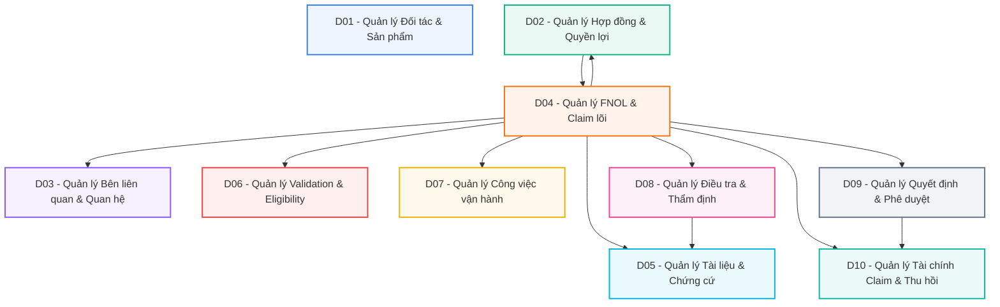

# F88 Claims Ontology Mermaid Diagrams

This document contains the visual representation of the F88 Claims Ontology using Mermaid diagrams.

## 1. High-Level Domain Relationship Flow
This diagram illustrates the relationship and flow of information between the 10 business domains.

## 2. Detailed Object-Level Ontology Diagram
This diagram shows every individual object/entity grouped by their business domain, as well as their internal and cross-domain relationships.

> [!NOTE]
> Solid arrows (`-->`) denote intra-domain relationships.
> Dashed arrows (`-.->`) denote cross-domain relationships.

```mermaid
flowchart TD
    %% Detailed Object-level Ontology Diagram
    subgraph D01 ["D01 - Quản lý Đối tác & Sản phẩm"]
        Partner["Partner\n(Đối tác)"]
        Product["Product\n(Sản phẩm)"]
        ProductVersion["ProductVersion\n(Phiên bản sản phẩm)"]
        ClaimType["ClaimType\n(Loại claim)"]
        CoverageTemplate["CoverageTemplate\n(Mẫu phạm vi bảo hiểm)"]
        BenefitTemplate["BenefitTemplate\n(Mẫu quyền lợi)"]
        RequiredDocumentTemplate["RequiredDocumentTemplate\n(Mẫu chứng từ bắt buộc)"]
        ProductRuleConfig["ProductRuleConfig\n(Cấu hình rule sản phẩm)"]
        ProductWorkflowConfig["ProductWorkflowConfig\n(Cấu hình workflow sản phẩm)"]
        ProviderContract["ProviderContract\n(Hợp đồng nhà cung cấp/TPA)"]
    end

    subgraph D02 ["D02 - Quản lý Hợp đồng & Quyền lợi"]
        Policy["Policy\n(Hợp đồng bảo hiểm)"]
        Certificate["Certificate\n(Giấy chứng nhận)"]
        Coverage["Coverage\n(Phạm vi bảo hiểm)"]
        BenefitGroup["BenefitGroup\n(Nhóm quyền lợi)"]
        BenefitDetail["BenefitDetail\n(Chi tiết quyền lợi)"]
        Limit["Limit\n(Hạn mức)"]
        Deductible["Deductible\n(Khấu trừ)"]
        Coinsurance["Coinsurance\n(Đồng chi trả)"]
        Exclusion["Exclusion\n(Điều khoản loại trừ)"]
        CoverageResult["CoverageResult\n(Kết quả kiểm tra coverage)"]
        BenefitEvaluation["BenefitEvaluation\n(Đánh giá quyền lợi)"]
        PolicySnapshot["PolicySnapshot\n(Snapshot hợp đồng)"]
    end

    subgraph D03 ["D03 - Quản lý Bên liên quan & Quan hệ"]
        Party["Party\n(Bên liên quan)"]
        PartyIdentity["PartyIdentity\n(Định danh bên liên quan)"]
        PartyContact["PartyContact\n(Liên hệ bên liên quan)"]
        ClaimParty["ClaimParty\n(Vai trò party trong claim)"]
        PartyRole["PartyRole\n(Vai trò party)"]
        Relationship["Relationship\n(Quan hệ giữa các bên)"]
        Payee["Payee\n(Người nhận tiền)"]
        AuthorizedPerson["AuthorizedPerson\n(Người được ủy quyền)"]
        ThirdParty["ThirdParty\n(Bên thứ ba)"]
        BankAccount["BankAccount\n(Tài khoản ngân hàng)"]
        Consent["Consent\n(Đồng ý/ủy quyền dữ liệu)"]
    end

    subgraph D04 ["D04 - Quản lý FNOL & Claim lõi"]
        FNOL["FNOL\n(Thông báo tổn thất đầu tiên)"]
        FNOLSubmission["FNOLSubmission\n(Lịch sử gửi/lưu nháp FNOL)"]
        FNOLSnapshot["FNOLSnapshot\n(Snapshot FNOL)"]
        Claim["Claim\n(Hồ sơ bồi thường)"]
        ClaimStatus["ClaimStatus\n(Trạng thái claim)"]
        ClaimLifecycle["ClaimLifecycle\n(Lifecycle claim)"]
        LossEvent["LossEvent\n(Sự kiện tổn thất)"]
        LossObject["LossObject\n(Đối tượng bị tổn thất)"]
        ClaimHistory["ClaimHistory\n(Lịch sử claim)"]
        ClaimEvent["ClaimEvent\n(Sự kiện claim)"]
        ClaimNote["ClaimNote\n(Ghi chú claim)"]
    end

    subgraph D05 ["D05 - Quản lý Tài liệu & Chứng cứ"]
        Document["Document\n(Tài liệu)"]
        DocumentType["DocumentType\n(Loại tài liệu)"]
        DocumentMetadata["DocumentMetadata\n(Metadata tài liệu)"]
        OCRResult["OCRResult\n(Kết quả OCR)"]
        ExtractedData["ExtractedData\n(Dữ liệu trích xuất)"]
        Evidence["Evidence\n(Chứng cứ)"]
        EvidencePackage["EvidencePackage\n(Gói chứng cứ)"]
        Invoice["Invoice\n(Hóa đơn)"]
        MedicalDocument["MedicalDocument\n(Tài liệu y tế)"]
        ImageEvidence["ImageEvidence\n(Ảnh chứng cứ)"]
        DeficiencyDocument["DeficiencyDocument\n(Chứng từ bổ sung thiếu)"]
        MediaFile["MediaFile\n(File media)"]
    end

    subgraph D06 ["D06 - Quản lý Validation & Eligibility"]
        DuplicateCheckResult["DuplicateCheckResult\n(Kết quả kiểm tra trùng)"]
        ValidationResult["ValidationResult\n(Kết quả validation)"]
        EligibilityCheck["EligibilityCheck\n(Kiểm tra điều kiện)"]
        BusinessRuleResult["BusinessRuleResult\n(Kết quả business rule)"]
        RequiredDocumentCheck["RequiredDocumentCheck\n(Kiểm tra chứng từ bắt buộc)"]
        PolicyValidityCheck["PolicyValidityCheck\n(Kiểm tra hiệu lực policy)"]
        CoverageEligibilityCheck["CoverageEligibilityCheck\n(Kiểm tra coverage eligibility)"]
        KYCCheck["KYCCheck\n(Kiểm tra KYC)"]
        Deficiency["Deficiency\n(Thiếu sót hồ sơ)"]
        DeficiencyRequest["DeficiencyRequest\n(Yêu cầu bổ sung)"]
        ValidationRuleResult["ValidationRuleResult\n(Kết quả rule validation)"]
    end

    subgraph D07 ["D07 - Quản lý Công việc vận hành"]
        WorkQueue["WorkQueue\n(Hàng đợi xử lý)"]
        WorkItem["WorkItem\n(Đơn vị công việc)"]
        Task["Task\n(Nhiệm vụ)"]
        Assignment["Assignment\n(Phân công)"]
        Workload["Workload\n(Tải công việc)"]
        SLA["SLA\n(Cam kết SLA)"]
        Escalation["Escalation\n(Leo thang)"]
        Reminder["Reminder\n(Nhắc việc)"]
        Team["Team\n(Đội xử lý)"]
        UserAssignment["UserAssignment\n(Phân công người dùng)"]
        Handoff["Handoff\n(Bàn giao công việc)"]
        WorkNote["WorkNote\n(Ghi chú công việc)"]
    end

    subgraph D08 ["D08 - Quản lý Điều tra & Thẩm định"]
        InvestigationCase["InvestigationCase\n(Hồ sơ điều tra)"]
        InvestigationFinding["InvestigationFinding\n(Kết quả điều tra)"]
        FraudSignal["FraudSignal\n(Tín hiệu gian lận)"]
        FraudScore["FraudScore\n(Điểm gian lận)"]
        LeakageIndicator["LeakageIndicator\n(Chỉ báo thất thoát)"]
        Assessment["Assessment\n(Hồ sơ thẩm định)"]
        AssessmentItem["AssessmentItem\n(Hạng mục thẩm định)"]
        MedicalAssessment["MedicalAssessment\n(Thẩm định y tế)"]
        VehicleAssessment["VehicleAssessment\n(Thẩm định xe)"]
        PropertyAssessment["PropertyAssessment\n(Thẩm định tài sản)"]
        MedicalExpenseItem["MedicalExpenseItem\n(Hạng mục chi phí y tế)"]
        VehicleDamageItem["VehicleDamageItem\n(Hạng mục hư hỏng xe)"]
        SettlementRecommendation["SettlementRecommendation\n(Đề xuất bồi thường)"]
    end

    subgraph D09 ["D09 - Quản lý Quyết định & Phê duyệt"]
        Decision["Decision\n(Quyết định bồi thường)"]
        DecisionVersion["DecisionVersion\n(Phiên bản quyết định)"]
        DecisionItem["DecisionItem\n(Hạng mục quyết định)"]
        ApprovalRequest["ApprovalRequest\n(Yêu cầu phê duyệt)"]
        ApprovalStep["ApprovalStep\n(Bước phê duyệt)"]
        ApprovalHistory["ApprovalHistory\n(Lịch sử phê duyệt)"]
        SettlementOffer["SettlementOffer\n(Đề nghị settlement)"]
        DecisionLetter["DecisionLetter\n(Thư quyết định)"]
        RejectionReason["RejectionReason\n(Lý do từ chối)"]
        AppealCase["AppealCase\n(Hồ sơ khiếu nại)"]
        DisputeCase["DisputeCase\n(Hồ sơ tranh chấp)"]
        DecisionExplanation["DecisionExplanation\n(Giải thích quyết định)"]
    end

    subgraph D10 ["D10 - Quản lý Tài chính Claim & Thu hồi"]
        Reserve["Reserve\n(Dự phòng bồi thường)"]
        Exposure["Exposure\n(Trách nhiệm tài chính)"]
        PaymentRequest["PaymentRequest\n(Yêu cầu thanh toán)"]
        PaymentTransaction["PaymentTransaction\n(Giao dịch thanh toán)"]
        Settlement["Settlement\n(Quyết toán/settlement)"]
        Recovery["Recovery\n(Thu hồi)"]
        Subrogation["Subrogation\n(Thế quyền)"]
        Reconciliation["Reconciliation\n(Đối soát)"]
        LiabilityAllocation["LiabilityAllocation\n(Phân bổ trách nhiệm)"]
        Reinsurance["Reinsurance\n(Tái bảo hiểm)"]
        FinancialLedger["FinancialLedger\n(Sổ cái tài chính)"]
        PayableItem["PayableItem\n(Khoản phải trả)"]
    end

    Partner -->|"sở hữu / phát hành (1 -> N)"| Product
    Product -->|"có phiên bản (1 -> N)"| ProductVersion
    ProductVersion -->|"định nghĩa coverage template (1 -> N)"| CoverageTemplate
    ProductVersion -->|"định nghĩa benefit template (1 -> N)"| BenefitTemplate
    ProductVersion -->|"định nghĩa chứng từ bắt buộc (1 -> N)"| RequiredDocumentTemplate
    ProductVersion -->|"cho phép loại claim (1 -> N)"| ClaimType
    Policy -->|"có giấy chứng nhận (1 -> N)"| Certificate
    Policy -->|"có coverage (1 -> N)"| Coverage
    Coverage -->|"có nhóm quyền lợi (1 -> N)"| BenefitGroup
    BenefitGroup -->|"có chi tiết quyền lợi (1 -> N)"| BenefitDetail
    BenefitDetail -->|"có hạn mức (1 -> N)"| Limit
    Claim -.->|"tham chiếu snapshot policy (N -> 1)"| PolicySnapshot
    FNOL -.->|"tham chiếu snapshot policy (N -> 1)"| PolicySnapshot
    CoverageResult -.->|"thuộc Claim (N -> 1)"| Claim
    Party -->|"có định danh (1 -> N)"| PartyIdentity
    Party -->|"có thông tin liên hệ (1 -> N)"| PartyContact
    Claim -.->|"có party theo vai trò (1 -> N)"| ClaimParty
    ClaimParty -->|"tham chiếu Party (N -> 1)"| Party
    ClaimParty -->|"có vai trò (N -> 1)"| PartyRole
    Payee -->|"có tài khoản (1 -> N)"| BankAccount
    FNOL -->|"có lịch sử gửi/lưu nháp (1 -> N)"| FNOLSubmission
    FNOL -->|"chuyển thành claim (1 -> 0..1)"| Claim
    Claim -->|"có sự kiện tổn thất (1 -> 1)"| LossEvent
    LossEvent -->|"gây tổn thất cho object (1 -> N)"| LossObject
    Claim -->|"có lịch sử (1 -> N)"| ClaimHistory
    Claim -->|"phát sinh event (1 -> N)"| ClaimEvent
    Claim -.->|"có tài liệu (1 -> N)"| Document
    FNOL -.->|"có tài liệu (1 -> N)"| Document
    Document -->|"có kết quả OCR (1 -> 0..N)"| OCRResult
    OCRResult -->|"trích xuất dữ liệu (1 -> N)"| ExtractedData
    Claim -.->|"có chứng cứ (1 -> N)"| Evidence
    EvidencePackage -->|"bao gồm evidence (1 -> N)"| Evidence
    Claim -.->|"có validation result (1 -> N)"| ValidationResult
    ValidationResult -->|"gồm rule result (1 -> N)"| BusinessRuleResult
    Claim -.->|"có eligibility check (1 -> N)"| EligibilityCheck
    Claim -.->|"phát sinh deficiency (1 -> N)"| Deficiency
    Deficiency -->|"có yêu cầu bổ sung (1 -> N)"| DeficiencyRequest
    Claim -.->|"sinh work item (1 -> N)"| WorkItem
    WorkQueue -->|"chứa work item (1 -> N)"| WorkItem
    WorkItem -->|"có task (1 -> N)"| Task
    Task -->|"được phân công (1 -> N)"| Assignment
    SLA -->|"áp SLA (1 -> N)"| WorkItem
    Escalation -->|"liên quan SLA (N -> 1)"| SLA
    Claim -.->|"có điều tra (1 -> 0..N)"| InvestigationCase
    InvestigationCase -->|"có finding (1 -> N)"| InvestigationFinding
    Claim -.->|"có assessment (1 -> N)"| Assessment
    Assessment -->|"có item (1 -> N)"| AssessmentItem
    Assessment -.->|"dựa trên evidence (N -> N)"| Evidence
    Assessment -->|"đề xuất settlement (1 -> 0..1)"| SettlementRecommendation
    Claim -.->|"có version quyết định (1 -> N)"| DecisionVersion
    Decision -->|"có item (1 -> N)"| DecisionItem
    Decision -->|"cần phê duyệt (1 -> N)"| ApprovalRequest
    ApprovalRequest -->|"có bước phê duyệt (1 -> N)"| ApprovalStep
    Decision -->|"phát hành thư (1 -> 0..1)"| DecisionLetter
    Decision -->|"có appeal (1 -> 0..N)"| AppealCase
    Claim -.->|"có reserve (1 -> N)"| Reserve
    Claim -.->|"có exposure (1 -> N)"| Exposure
    Decision -.->|"tạo payment request (1 -> N)"| PaymentRequest
    PaymentRequest -->|"có transaction (1 -> N)"| PaymentTransaction
    PaymentTransaction -->|"được đối soát (N -> 1)"| Reconciliation
    Claim -.->|"có recovery (1 -> 0..N)"| Recovery
    Claim -.->|"liên quan tái bảo hiểm (1 -> 0..N)"| Reinsurance

    style D01 fill:#3b82f608,stroke:#3b82f6,stroke-dasharray: 5 5
    style D02 fill:#10b98108,stroke:#10b981,stroke-dasharray: 5 5
    style D03 fill:#8b5cf608,stroke:#8b5cf6,stroke-dasharray: 5 5
    style D04 fill:#f9731608,stroke:#f97316,stroke-dasharray: 5 5
    style D05 fill:#06b6d408,stroke:#06b6d4,stroke-dasharray: 5 5
    style D06 fill:#ef444408,stroke:#ef4444,stroke-dasharray: 5 5
    style D07 fill:#eab30808,stroke:#eab308,stroke-dasharray: 5 5
    style D08 fill:#ec489908,stroke:#ec4899,stroke-dasharray: 5 5
    style D09 fill:#64748b08,stroke:#64748b,stroke-dasharray: 5 5
    style D10 fill:#14b8a608,stroke:#14b8a6,stroke-dasharray: 5 5
```

